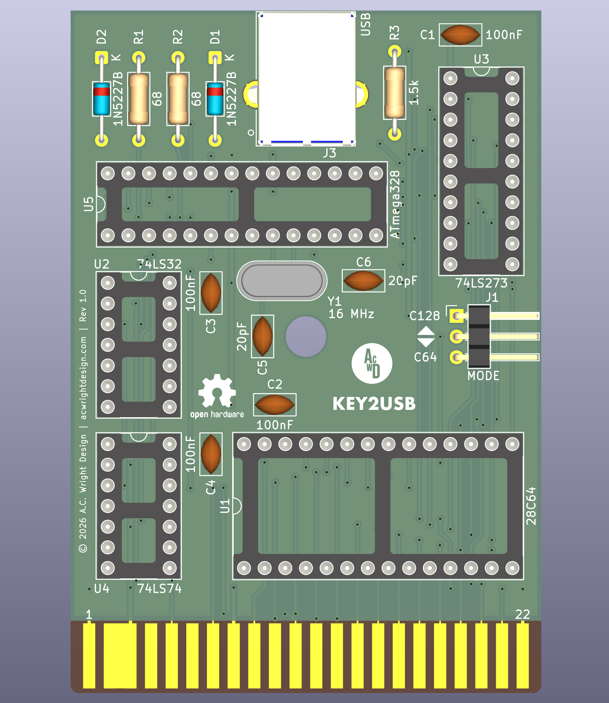

KEY2USB
=======

A non-invasive **Commodore 64 / C128** expansion port cartridge that lets the machine's own physical keyboard act as a **USB HID keyboard** for a connected PC running the VICE emulator. Plug it in, power on the C64, connect a USB cable — no case modification, no soldering into the keyboard.

---

## Table of Contents

- [Overview](#overview)
- [Architecture](#architecture)
- [Hardware](#hardware)
  - [KEY2USB Board](#key2usb-board)
    - [Revision History](#revision-history)
- [Firmware](#firmware)
- [VICE Setup](#vice-setup)
- [CAD](#cad)
- [Production](#production)
- [Schematics](#schematics)
- [Libraries](#libraries)
- [Bill of Materials](#bill-of-materials)
- [License](#license)

---

## Overview

**KEY2USB** is a C64 cartridge that solves a specific problem: when running the VICE emulator on a PC alongside a real Commodore 64, you can't easily use the C64's authentic keyboard as a USB input device without modifying the machine. KEY2USB plugs into the expansion port and bridges the C64's keyboard matrix — read by the C64's own 6502 — to a USB HID keyboard interface, using no invasive hardware modifications.

Compatible with the **Commodore 64**, **Commodore 128** (in C64 or native mode), and the **Ultimate 64** FPGA board.

## Architecture

- **ROM side**: A 28C64 EEPROM holds two 4K firmware banks (C64 / C128). The bank and `/EXROM` state are selected together by a single `MODE` jumper.
- **Glue logic**: A 74LS32 (quad OR gate) generates a write strobe from `/IO1` + `R/W`; a 74LS273 (8-bit D flip-flop register) latches the key-event byte the 6502 firmware writes to `$DE00`; a 74LS74 (dual D flip-flop) provides a single `RDY` handshake flag.
- **USB side**: An ATmega328P-PU runs the [V-USB](https://www.obdev.at/products/vusb/index.html) software USB stack, polls the latch via the `RDY` flag, and sends 8-byte USB HID boot-protocol keyboard reports. A 16 MHz crystal clocks the MCU.
- **USB front end**: Two 68Ω series resistors on D+ and D−, two 1N5227B (3.6V) Zener diodes to clamp the lines to spec, and a 1.5kΩ D− pull-up to +5V to signal a low-speed USB device — no 3.3V rail needed.
- **PCB constraint**: 100% through-hole / DIP — no SMD parts.

The two sides share only a single byte-wide latch and one ready flag — no shared clock or bus timing requirements.

## Hardware

This repository contains the KiCad 10.0 PCB design for the KEY2USB board.

### KEY2USB Board
`Hardware/`

A single cartridge PCB hosting the ROM, glue logic, and USB MCU. Provides:

- **ROM**: 28C64 EEPROM (DIP-28) preloaded with C64 and C128 keyboard-scan firmware
- **Write strobe**: 74LS32 quad OR gate — asserts `WRSTB` from `/IO1` + `R/W`
- **Key-event latch**: 74LS273 octal D flip-flop register — captures the byte written to `$DE00`
- **Handshake flag**: 74LS74 dual D flip-flop — one half as the `RDY`/`/CLRRDY` flag
- **USB MCU**: ATmega328P-PU (DIP-28) running V-USB, reads the latch, emits USB HID reports
- **Crystal**: 16 MHz THT crystal + 2× 20pF load capacitors
- **USB front end**: USB Type B connector, 68Ω series resistors, 1N5227B Zener clamps, 1.5kΩ D− pull-up
- **Mode select**: 3-pin 2.54mm jumper header — selects C64 mode (GND, asserts `/EXROM`, lower 4K EEPROM bank) or C128 mode (+5V, releases `/EXROM`, upper 4K EEPROM bank)
- **Bus connection**: 44-pin C64 expansion port edge connector
- **Power**: Drawn from the C64's own +5V via the expansion port

#### Revision History

**Rev 1.0**

- Initial release.

## Firmware

Both firmwares are implemented in `Firmware/` (see `Firmware/README.md` for build,
flash, and layout details). Set VICE's keyboard mapping to **Positional** — see
[VICE Setup](#vice-setup).

**6502 side (per bank):**
- Autostart via the `CBM80` signature (C64) or `CBM` / `$01` header (C128 bank), take over the machine, and draw a centered `KEY2USB` splash on the 40-column screen.
- Scan the keyboard matrix directly via CIA #1 (`$DC00`/`$DC01`) for raw make/break events and modifier state — no KERNAL buffer.
- On any key state change, write a one-byte event to `$DE00`.
- Optionally (off by default), the C128 bank can also scan the extended keys — numeric keypad, ESC, TAB, ALT, HELP, and cursor pad — via `$D02F`.

**ATmega328/328P side:**
- Poll `RDY`; on set, read the key byte from `PINC`/`PINB`, pulse `/CLRRDY`.
- Run V-USB (low-speed USB 1.1); translate to USB HID usages and send an 8-byte boot-protocol keyboard report.
- Configured as a self-powered USB device.

## VICE Setup

One setting trips people up every time, so set it before anything else:

- **Keyboard mapping must be Positional, not Symbolic.** KEY2USB sends raw
  physical key positions (and the raw SHIFT/CTRL/C= state) over USB, the same
  way a real C64 keyboard's matrix works — it does not translate to characters.
  VICE's default/Symbolic keymap assumes a host keyboard layout and will map
  keys to the wrong C64 characters, or seem to "not work," even though every
  keystroke is arriving correctly. In VICE: **Settings → Keyboard → Keyboard
  Mapping → Positional**. This is the single most common first-time setup
  mistake — if keys look wrong, check this first.
- **PAL vs. NTSC does not matter.** That setting only affects VIC-II video
  timing (cycles per line, refresh rate); the keyboard matrix and CIA #1 are
  identical either way, so KEY2USB works under both.
- USB HID reports are sent as a standard boot-protocol keyboard — no special
  VICE driver or configuration is needed beyond the keymap.

## CAD
`CAD/`

3D models and render images for the KEY2USB board.

## Production
`Production/`

JLCPCB-ready fabrication files, BOM, and component positions for PCB fabrication.

## Schematics
`Schematics/`

PDF schematic for the KEY2USB board.

## Libraries
`Libraries/`

Custom KiCad symbol and footprint libraries, including the C64 expansion port edge connector footprint and the USB Type B connector footprint.

## Bill of Materials

| Reference | Qty | Value | Description | Digikey |
|-----------|-----|-------|-------------|---------|
| C1, C2, C3, C4 | 4 | 100nF | Ceramic disc capacitor — IC bypass | [478-5732-ND](https://www.digikey.com/en/products/filter?keywords=478-5732-ND) |
| C5, C6 | 2 | 20pF | Ceramic disc capacitor — crystal load | [478-7724-ND](https://www.digikey.com/en/products/filter?keywords=478-7724-ND) |
| D1, D2 | 2 | 1N5227B | 3.6V Zener diode, DO-35 — USB line clamp | [1N5227B-ND](https://www.digikey.com/en/products/filter?keywords=1N5227B-ND) |
| J1 | 1 | MODE | 3-pin 2.54mm header + jumper cap — C64 / C128 mode select | [S1121EC-03-ND](https://www.digikey.com/en/products/filter?keywords=S1121EC-03-ND) |
| J2 | 1 | C64 EXP PORT | C64 expansion port edge connector (44-pin, 3.96mm pitch) | |
| J3 | 1 | USB | USB Type B connector, through-hole (UJ2-BH-BL1-TH) | [102-5886-ND](https://www.digikey.com/en/products/filter?keywords=102-5886-ND) |
| R1, R2 | 2 | 68Ω | Resistor, 1/4W — USB D+ / D− series | [S68CACT-ND](https://www.digikey.com/en/products/filter?keywords=S68CACT-ND) |
| R3 | 1 | 1.5kΩ | Resistor, 1/4W — USB D− pull-up to +5V | [S1.5KCACT-ND](https://www.digikey.com/en/products/filter?keywords=S1.5KCACT-ND) |
| U1 | 1 | 28C64 | 8K×8 EEPROM, DIP-28 — holds C64 and C128 firmware banks | [AT28C64B-15PU-ND](https://www.digikey.com/en/products/filter?keywords=AT28C64B-15PU-ND) |
| U2 | 1 | 74LS32 | Quad 2-input OR gate, DIP-14 — generates write strobe | [296-1658-5-ND](https://www.digikey.com/en/products/filter?keywords=296-1658-5-ND) |
| U3 | 1 | 74LS273 | 8-bit D flip-flop register, DIP-20 — key-event latch | [296-1657-5-ND](https://www.digikey.com/en/products/filter?keywords=296-1657-5-ND) |
| U4 | 1 | 74LS74 | Dual D flip-flop, DIP-14 — RDY handshake flag | [296-1668-5-ND](https://www.digikey.com/en/products/filter?keywords=296-1668-5-ND) |
| U5 | 1 | ATmega328P-PU | 8-bit AVR MCU, DIP-28 — V-USB and HID firmware | [ATMEGA328-PU-ND](https://www.digikey.com/en/products/filter?keywords=ATMEGA328-PU-ND) |
| Y1 | 1 | 16 MHz | Crystal, through-hole — ATmega328P clock | [3155-16M20P2/49US-ND](https://www.digikey.com/en/products/filter?keywords=3155-16M20P2/49US-ND) |

## License

Hardware designs are released under the [CERN Open Hardware Licence Version 2 – Permissive](https://ohwr.org/cern_ohl_p_v2.txt).
